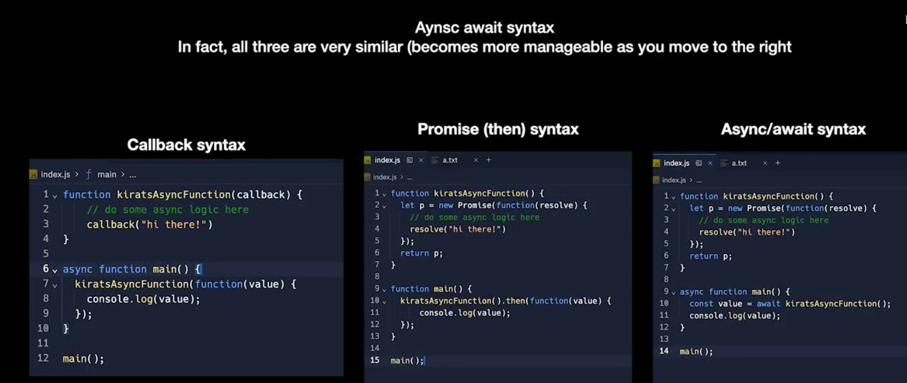

# 100xDevs

Welcome to the 100xDevs project! Here, we dive into the modern JavaScript asynchronous programming concepts: Callbacks, Promises, and Async/Await. Below is a quick visual guide to understanding Async/Await.

## Asynchronous Programming in JavaScript

Asynchronous programming is a method of handling operations that may take some time to complete, such as fetching data from an API, reading files, or querying a database. JavaScript provides several approaches to handle asynchronous operations, namely Callbacks, Promises, and Async/Await.

### Callbacks

Callbacks are functions passed as arguments to other functions. They are executed after the completion of an operation, allowing JavaScript to continue running other code in the meantime.

### Promises

Promises represent the future result of an asynchronous operation. They can be in one of three states: pending, fulfilled, or rejected. Promises provide a cleaner, more manageable way to handle the outcomes of asynchronous operations.

### Async/Await

Async/Await is syntactic sugar built on top of Promises. It provides a more straightforward way to write asynchronous code that looks and behaves a bit more like synchronous code, making it easier to read and understand.

#### Gist of Async/Await

Below is a visual representation of how Async/Await simplifies working with Promises:

This diagram illustrates the flow and structure of Async/Await in JavaScript, providing a clearer understanding of its operation and benefits.

---

Thank you for exploring asynchronous programming with us. For more information and detailed explanations, please refer to the [MDN Web Docs on Asynchronous Programming](https://developer.mozilla.org/en-US/docs/Learn/JavaScript/Asynchronous).

